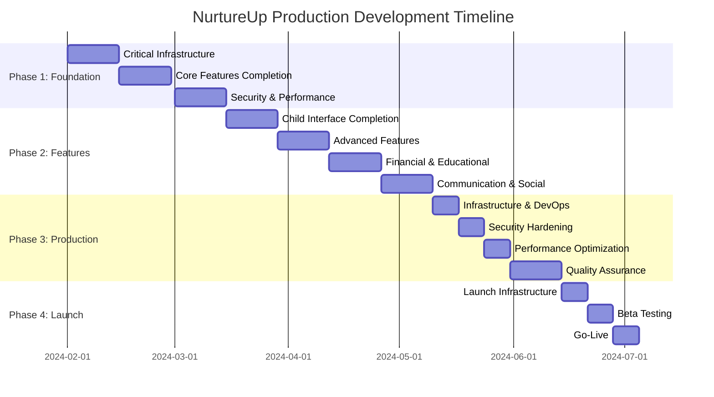

# NurtureUp Production Development Plan
*A comprehensive roadmap for building a production-ready family development app*

---

## Executive Summary

NurtureUp is a comprehensive family development app that adapts to children's growth stages from TTC/pregnancy through adolescence (18 years). We have excellent foundational architecture (65% production-ready) with beautiful UI designs and solid technical decisions, but need systematic completion and hardening before production launch.

**Current State**: Well-architected foundation with critical gaps
**Goal**: Production-ready app with 2 user types (parents & children) supporting complex family structures
**Approach**: Phased development focusing on stability, completion, and scalability

---

## Table of Contents

1. [Current Assessment & Gap Analysis](#1-current-assessment--gap-analysis)
2. [Production Architecture Strategy](#2-production-architecture-strategy) 
3. [Development Phases & Roadmap](#3-development-phases--roadmap)
4. [Technical Infrastructure Plan](#4-technical-infrastructure-plan)
5. [Feature Implementation Strategy](#5-feature-implementation-strategy)
6. [Quality Assurance & Testing Plan](#6-quality-assurance--testing-plan)
7. [Launch Strategy](#7-launch-strategy)
8. [Long-term Scalability Plan](#8-long-term-scalability-plan)

---

## 1. Current Assessment & Gap Analysis

### 1.1 What We Have (Strengths) ✅

**Excellent Foundation:**
- ✅ Comprehensive Next.js 15 + React 19 + TypeScript stack
- ✅ Beautiful adaptive UI system that changes based on child development stages
- ✅ Sophisticated database schema (20+ models) covering all major features
- ✅ Real-time sync with Pusher + offline-first architecture
- ✅ Modern authentication system with NextAuth.js
- ✅ Stage engine that automatically adapts interface based on child age
- ✅ Task management system with optimistic updates
- ✅ Professional glass-morphism design system

**Detailed Blueprints:**
- ✅ Complete child interface specifications for all 6 development stages
- ✅ Complete parent interface specifications for all stages
- ✅ Accessibility, internationalization, and performance guidelines
- ✅ Component library and design token specifications

### 1.2 Critical Gaps to Address ❌

**Immediate Blockers:**
- ❌ Database foreign key constraint violations preventing proper operation
- ❌ Broken test environment setup
- ❌ Incomplete child interfaces (only early childhood fully implemented)
- ❌ Missing production-level error handling and validation
- ❌ No health checks, monitoring, or production infrastructure

**Major Missing Features:**
- ❌ Parent-child account linking system
- ❌ Multi-parent family support (divorce/separation scenarios)
- ❌ Learning game integrations
- ❌ Advanced mood tracking and wellbeing center
- ❌ Financial literacy and allowance management
- ❌ School readiness assessments
- ❌ Teen privacy contracts and location check-ins

**Production Infrastructure:**
- ❌ Security hardening (CSRF, rate limiting, audit logs)
- ❌ Performance optimization (caching, query optimization)
- ❌ Monitoring and observability
- ❌ Backup and disaster recovery
- ❌ CI/CD pipeline with automated testing

### 1.3 Production Readiness Score

| Component | Current % | Target % | Priority |
|-----------|-----------|----------|----------|
| Database Layer | 60% | 95% | 🔴 Critical |
| API Layer | 70% | 95% | 🔴 Critical |
| Parent UI | 85% | 95% | 🟡 High |
| Child UI | 40% | 95% | 🔴 Critical |
| Security | 65% | 95% | 🔴 Critical |
| Performance | 50% | 90% | 🟡 High |
| Testing | 30% | 85% | 🟡 High |
| Infrastructure | 35% | 90% | 🟡 High |

**Overall Readiness: 59% → Target: 92%**

---

## 2. Production Architecture Strategy

### 2.1 Modular Architecture Principles

**Clean Architecture Layers:**
```
┌─────────────────────────────────────────────────────────────┐
│                    USER INTERFACES                          │
│  ┌─────────────────┐    ┌─────────────────┐                │
│  │   Parent App    │    │   Child App     │                │
│  │  (All Stages)   │    │ (Age-Adaptive)  │                │
│  └─────────────────┘    └─────────────────┘                │
├─────────────────────────────────────────────────────────────┤
│                    APPLICATION LAYER                        │
│  ┌─────────────────┐    ┌─────────────────┐                │
│  │  Stage Engine   │    │  Family Manager │                │
│  │ (Age Detection) │    │ (Multi-parent)  │                │
│  └─────────────────┘    └─────────────────┘                │
├─────────────────────────────────────────────────────────────┤
│                    BUSINESS LOGIC LAYER                     │
│  ┌─────────────┐ ┌─────────────┐ ┌─────────────┐           │
│  │    Tasks    │ │   Rewards   │ │   Learning  │           │
│  │  Management │ │   System    │ │   Engine    │           │
│  └─────────────┘ └─────────────┘ └─────────────┘           │
├─────────────────────────────────────────────────────────────┤
│                    DATA ACCESS LAYER                        │
│  ┌─────────────┐ ┌─────────────┐ ┌─────────────┐           │
│  │   Prisma    │ │   Pusher    │ │   File      │           │
│  │   ORM       │ │   Realtime  │ │   Storage   │           │
│  └─────────────┘ └─────────────┘ └─────────────┘           │
├─────────────────────────────────────────────────────────────┤
│                    INFRASTRUCTURE LAYER                     │
│  ┌─────────────┐ ┌─────────────┐ ┌─────────────┐           │
│  │  Database   │ │   Cache     │ │   CDN       │           │
│  │  (SQLite/   │ │   (Redis)   │ │ (Cloudinary)│           │
│  │  PostgreSQL)│ │             │ │             │           │
│  └─────────────┘ └─────────────┘ └─────────────┘           │
└─────────────────────────────────────────────────────────────┘
```

### 2.2 Family Structure Support

**Complex Family Models:**
- ✅ Single parent households
- ✅ Two-parent households  
- ✅ Divorced/separated parents (multiple guardians)
- ✅ Grandparent/caregiver involvement
- ✅ Foster family situations
- ✅ Multiple children of different ages

**Account Linking Strategy:**
```typescript
interface FamilyStructure {
  family: Family
  primaryParents: Parent[]      // Main guardians
  secondaryParents: Parent[]    // Divorced/separated parents
  caregivers: Caregiver[]       // Grandparents, nannies, etc.
  children: Child[]             // All children in family unit
  permissions: PermissionMatrix // Who can access what
}
```

### 2.3 Scalability Architecture

**Horizontal Scaling Ready:**
- ✅ Stateless API design with JWT tokens
- ✅ Database connection pooling
- ✅ Redis caching layer for session data
- ✅ CDN for static assets and images
- ✅ Message queue for background tasks

**Performance Optimization:**
- ✅ Database query optimization with proper indexes
- ✅ React Query for client-side caching
- ✅ Image optimization with next/image
- ✅ Code splitting by stage for smaller bundles
- ✅ Progressive Web App capabilities

---

## 3. Development Phases & Roadmap

### Phase 1: Foundation Stabilization (4-6 weeks)
*Priority: Fix critical issues and establish stable foundation*

**Week 1-2: Critical Infrastructure**
- 🔴 Fix database foreign key constraints and migration issues
- 🔴 Repair test environment setup (Jest, Prisma, test database)
- 🔴 Implement comprehensive error handling across all APIs
- 🔴 Add Zod validation schemas to all endpoints
- 🔴 Set up basic health checks and monitoring

**Week 3-4: Core Features Completion**
- 🔴 Complete parent-child account linking system
- 🔴 Implement multi-parent family support
- 🔴 Finish basic child interfaces for all stages
- 🔴 Complete task management workflow end-to-end
- 🔴 Implement reward system with proper approval flows

**Week 5-6: Security & Performance**
- 🟡 Add CSRF protection and security headers
- 🟡 Implement rate limiting and DDoS protection  
- 🟡 Add database indexes and query optimization
- 🟡 Set up Redis caching layer
- 🟡 Complete input sanitization and XSS protection

**Phase 1 Success Criteria:**
- ✅ All tests passing with >70% coverage
- ✅ No database constraint violations
- ✅ Basic parent and child workflows functional
- ✅ Security audit passing
- ✅ Performance benchmarks met (< 2s load times)

### Phase 2: Feature Completion (6-8 weeks)
*Priority: Complete all major features per blueprints*

**Week 1-2: Child Interface Completion**
- 🔴 Complete Toddler interface (potty training, behavior tracking)
- 🔴 Complete School Age interface (homework, wallet, badges)
- 🔴 Complete Adolescence interface (planner, wellbeing, privacy)
- 🔴 Implement stage transition animations and flows

**Week 3-4: Advanced Features**
- 🟡 Learning game integration and progress tracking
- 🟡 Virtual pet system with care mechanics
- 🟡 Badge system with achievement celebrations
- 🟡 Mood tracking and wellbeing center
- 🟡 Screen time management and parental controls

**Week 5-6: Financial & Educational Features**
- 🟡 Allowance and financial transaction system
- 🟡 Savings goals and payout requests
- 🟡 School readiness assessments
- 🟡 Health record tracking for infants
- 🟡 Milestone photography and family timeline

**Week 7-8: Communication & Social Features**
- 🟢 Family challenges and friendly competition
- 🟢 Notification system with smart scheduling
- 🟢 Real-time celebration sharing
- 🟢 Privacy contracts for teenagers
- 🟢 Location check-ins and safety features

**Phase 2 Success Criteria:**
- ✅ All 6 child development stages fully functional
- ✅ All blueprint features implemented
- ✅ Real-time sync working across all features
- ✅ Comprehensive parent dashboard complete
- ✅ Performance maintained under feature load

### Phase 3: Production Hardening (4-5 weeks)
*Priority: Enterprise-grade reliability and performance*

**Week 1: Infrastructure & DevOps**
- 🟡 Set up CI/CD pipeline with automated testing
- 🟡 Configure production database (PostgreSQL)
- 🟡 Implement backup and disaster recovery
- 🟡 Set up monitoring with alerts (DataDog/New Relic)
- 🟡 Configure CDN and asset optimization

**Week 2: Security Hardening**
- 🟡 Complete security audit and penetration testing
- 🟡 Implement audit logging for all sensitive actions
- 🟡 Add two-factor authentication for parents
- 🟡 Complete COPPA and GDPR compliance review
- 🟡 Set up vulnerability scanning and monitoring

**Week 3: Performance Optimization**
- 🟡 Database query optimization and connection pooling
- 🟡 Implement Redis caching strategy
- 🟡 Optimize bundle sizes and code splitting
- 🟡 Add service worker for offline functionality
- 🟡 Performance testing under load

**Week 4-5: Quality Assurance**
- 🟡 Complete automated test suite (unit, integration, e2e)
- 🟡 User acceptance testing with beta families
- 🟡 Accessibility testing and WCAG compliance
- 🟡 Cross-browser and device compatibility testing
- 🟡 Load testing and stress testing

**Phase 3 Success Criteria:**
- ✅ 99.9% uptime SLA achievable
- ✅ Sub-1s API response times
- ✅ Security audit passed with zero critical issues
- ✅ Automated test coverage >85%
- ✅ Ready for production deployment

### Phase 4: Launch Preparation (2-3 weeks)
*Priority: Final polish and launch readiness*

**Week 1: Launch Infrastructure**
- 🟢 Production environment setup and testing
- 🟢 DNS configuration and SSL certificates
- 🟢 Error tracking and logging setup
- 🟢 Analytics and user tracking implementation
- 🟢 Support system and documentation

**Week 2: Beta Testing**
- 🟢 Private beta with 10-20 families
- 🟢 Bug fixes and performance tuning
- 🟢 User feedback integration
- 🟢 Final UI/UX polish
- 🟢 Marketing site and onboarding flow

**Week 3: Go-Live**
- 🟢 Production deployment
- 🟢 Monitoring and on-call setup
- 🟢 User onboarding and support
- 🟢 Performance monitoring and optimization
- 🟢 Iterative improvements based on real usage

**Phase 4 Success Criteria:**
- ✅ Successful production deployment
- ✅ Beta user feedback incorporated
- ✅ Support system operational
- ✅ Monitoring and alerting functional
- ✅ Ready for public launch

---

## 4. Technical Infrastructure Plan

### 4.1 Local Development Environment

**Development Stack:**
```bash
# Core stack
Node.js 18+ with npm/yarn
Next.js 15.4.3 with React 19
TypeScript 5+ 
SQLite for development
Prisma ORM

# Development tools
ESLint + Prettier for code quality
Husky + lint-staged for pre-commit hooks
Jest + Testing Library for testing
Storybook for component development

# Real-time features
Pusher for WebSocket connections
Redis for session caching (optional locally)
```

**Development Workflow:**
```bash
# Setup new developer
git clone [repo]
npm install
npx prisma generate
npx prisma db push
npm run seed
npm run dev

# Development commands
npm run dev          # Start development server
npm run build        # Production build
npm run test         # Run test suite
npm run lint         # Code quality checks
npm run storybook    # Component library
```

### 4.2 Production Infrastructure

**Hosting Strategy:**
- **Application**: Vercel (Next.js optimized) or AWS ECS
- **Database**: PostgreSQL on AWS RDS or PlanetScale
- **Cache**: Redis on AWS ElastiCache
- **Storage**: Cloudinary for images, AWS S3 for backups
- **CDN**: Vercel Edge Network or CloudFront
- **Monitoring**: DataDog or New Relic

**Scaling Strategy:**
```typescript
// Auto-scaling configuration
interface ScalingConfig {
  minInstances: 2         // Always have 2 instances
  maxInstances: 20        // Scale up to 20 under load
  targetCPU: 70          // Scale when CPU > 70%
  targetMemory: 80       // Scale when memory > 80%
  scaleUpCooldown: 300   // Wait 5min between scale-ups
  scaleDownCooldown: 600 // Wait 10min between scale-downs
}
```

### 4.3 Data Architecture

**Database Strategy:**
```sql
-- Production database setup
-- PostgreSQL 14+ with connection pooling
-- Read replicas for reporting queries
-- Automated backups every 6 hours
-- Point-in-time recovery enabled

-- Performance optimizations
CREATE INDEX CONCURRENTLY idx_tasks_child_due ON tasks(assigned_to_id, due_date);
CREATE INDEX CONCURRENTLY idx_completions_child_date ON task_completions(child_id, completed_at);
CREATE INDEX CONCURRENTLY idx_mood_child_date ON mood_entries(child_id, logged_at);
```

**Caching Strategy:**
```typescript
// Redis caching layers
interface CacheStrategy {
  sessions: 24 * 60 * 60,        // 24 hours
  userProfiles: 6 * 60 * 60,     // 6 hours
  familyData: 2 * 60 * 60,       // 2 hours
  taskLists: 30 * 60,            // 30 minutes
  leaderboards: 15 * 60,         // 15 minutes
  realTimeData: 5 * 60           // 5 minutes
}
```

---

## 5. Feature Implementation Strategy

### 5.1 Parent-Child Account Linking System

**Implementation Approach:**
```typescript
// Family creation and linking flow
interface FamilySetup {
  step1: CreatePrimaryParent    // Main parent signs up
  step2: SetupFamilyProfile     // Family name, timezone, settings
  step3: AddChildren            // Add children with birth dates
  step4: InviteSecondaryParents // Ex-spouses, partners, etc.
  step5: InviteCaregivers       // Grandparents, nannies, etc.
  step6: ConfigurePermissions   // Who can access what
}

// Permission matrix system
interface PermissionMatrix {
  [userId: string]: {
    canViewTasks: boolean
    canAssignTasks: boolean
    canApproveTasks: boolean
    canManageRewards: boolean
    canViewMoodData: boolean
    canManageScreenTime: boolean
    canAccessMedicalData: boolean
    emergencyContact: boolean
  }
}
```

**Multi-Parent Support:**
- ✅ Primary parents have full access
- ✅ Secondary parents have configurable access
- ✅ Automatic conflict resolution for divorced parents
- ✅ Shared calendar with permission controls
- ✅ Independent notification preferences

### 5.2 Age-Adaptive UI System

**Stage Detection Algorithm:**
```typescript
function calculateDevelopmentStage(birthDate: Date): DevelopmentStage {
  const ageInMonths = differenceInMonths(new Date(), birthDate)
  
  if (ageInMonths < 12) return 'NEWBORN'
  if (ageInMonths < 36) return 'TODDLER' 
  if (ageInMonths < 72) return 'EARLY_CHILDHOOD'
  if (ageInMonths < 156) return 'SCHOOL_AGE'
  if (ageInMonths < 216) return 'ADOLESCENCE'
  return 'YOUNG_ADULT'
}

// Stage-specific feature configuration
const STAGE_CONFIG = {
  NEWBORN: {
    features: ['feeding', 'sleep', 'diaper', 'growth'],
    gamification: false,
    screenTime: false
  },
  TODDLER: {
    features: ['potty', 'behavior', 'play', 'routine'],
    gamification: 'basic', // Stars and stickers
    screenTime: 'limited'
  },
  EARLY_CHILDHOOD: {
    features: ['chores', 'learning', 'avatar', 'rewards'],
    gamification: 'full', // Stars, coins, badges
    screenTime: 'managed'
  },
  // ... etc for all stages
}
```

### 5.3 Real-time Synchronization

**Pusher Integration Strategy:**
```typescript
// Real-time channels per family
const channels = {
  family: `family-${familyId}`,           // General family updates
  tasks: `tasks-${familyId}`,             // Task assignments/completions  
  rewards: `rewards-${familyId}`,         // Reward purchases/approvals
  celebrations: `celebrations-${familyId}`, // Badge earned, milestones
  notifications: `notifications-${userId}` // Personal notifications
}

// Optimistic updates with rollback
function useOptimisticTaskCompletion() {
  const [tasks, setTasks] = useState([])
  
  const completeTask = async (taskId: string) => {
    // Optimistic update
    setTasks(prev => prev.map(task => 
      task.id === taskId 
        ? { ...task, status: 'completed' }
        : task
    ))
    
    try {
      await api.completeTask(taskId)
      // Success - optimistic update was correct
    } catch (error) {
      // Rollback optimistic update
      setTasks(prev => prev.map(task => 
        task.id === taskId 
          ? { ...task, status: 'pending' }
          : task
      ))
      throw error
    }
  }
}
```

### 5.4 Learning Game Integration

**Game Engine Architecture:**
```typescript
interface LearningGame {
  id: string
  title: string
  description: string
  ageRange: [number, number]        // [minAge, maxAge] in months
  subject: 'phonics' | 'math' | 'shapes' | 'colors'
  difficulty: 1 | 2 | 3 | 4 | 5
  estimatedMinutes: number
  xpReward: number
  starReward: number
}

interface GameSession {
  gameId: string
  childId: string
  startTime: Date
  endTime?: Date
  score: number                     // 0-100
  xpEarned: number
  starsEarned: number
  metadata: {
    difficulty: number
    attempts: number
    hintsUsed: number
    perfectScore: boolean
  }
}

// Game progression system
function calculateGameProgression(child: Child): GameRecommendations {
  const ageInMonths = getAgeInMonths(child.birthDate)
  const completedGames = getCompletedGames(child.id)
  const skillLevels = calculateSkillLevels(completedGames)
  
  return {
    recommended: filterGamesByAge(ageInMonths)
      .filter(game => game.difficulty <= skillLevels[game.subject] + 1),
    locked: filterGamesByAge(ageInMonths)
      .filter(game => game.difficulty > skillLevels[game.subject] + 1),
    mastered: completedGames
      .filter(session => session.score >= 90)
      .map(session => session.gameId)
  }
}
```

---

## 6. Quality Assurance & Testing Plan

### 6.1 Testing Strategy

**Test Pyramid:**
```typescript
// Unit Tests (70% coverage target)
// - Pure functions and business logic
// - Custom hooks and utilities  
// - Component rendering and interactions
// - API route handlers

// Integration Tests (20% coverage target)  
// - Database operations with Prisma
// - API endpoints with request/response
// - Authentication flows
// - Real-time features with Pusher

// End-to-End Tests (10% coverage target)
// - Critical user journeys
// - Cross-stage transitions
// - Parent-child interaction flows
// - Multi-device synchronization
```

**Test Configuration:**
```javascript
// jest.config.js
module.exports = {
  setupFilesAfterEnv: ['<rootDir>/jest.setup.js'],
  testEnvironment: 'jsdom',
  transform: {
    '^.+\\.(js|jsx|ts|tsx)$': ['babel-jest', { presets: ['next/babel'] }]
  },
  moduleNameMapping: {
    '^@/(.*)$': '<rootDir>/src/$1'
  },
  collectCoverageFrom: [
    'src/**/*.{js,jsx,ts,tsx}',
    '!src/**/*.d.ts',
    '!src/**/*.stories.{js,jsx,ts,tsx}'
  ],
  coverageThreshold: {
    global: {
      branches: 70,
      functions: 70,
      lines: 70,
      statements: 70
    }
  }
}
```

### 6.2 Test Implementation Plan

**Week 1-2: Test Infrastructure**
- ✅ Fix existing test setup issues
- ✅ Configure test database with Prisma
- ✅ Set up testing utilities and mocks
- ✅ Configure CI/CD test running

**Week 3-4: Unit Tests**
- ✅ Test all custom hooks (useOptimisticTasks, etc.)
- ✅ Test utility functions and stage engine
- ✅ Test component rendering and interactions
- ✅ Test API route handlers

**Week 5-6: Integration Tests**
- ✅ Test database operations and constraints
- ✅ Test authentication and authorization
- ✅ Test real-time synchronization
- ✅ Test parent-child linking flows

**Week 7-8: E2E Tests**
- ✅ Test critical user journeys (onboarding, task completion)
- ✅ Test stage transitions
- ✅ Test multi-user family scenarios
- ✅ Test offline/online synchronization

### 6.3 Performance Testing

**Load Testing Strategy:**
```typescript
// Performance benchmarks
interface PerformanceBenchmarks {
  pageLoad: {
    target: 1500,        // 1.5s for initial page load
    acceptable: 2000     // 2s maximum acceptable
  },
  apiResponse: {
    target: 200,         // 200ms for API responses
    acceptable: 500      // 500ms maximum acceptable
  },
  realTimeSync: {
    target: 100,         // 100ms for real-time updates
    acceptable: 250      // 250ms maximum acceptable
  },
  databaseQuery: {
    target: 50,          // 50ms for simple queries
    acceptable: 200      // 200ms for complex queries
  }
}

// Load testing scenarios
const loadTests = [
  {
    name: 'Normal Family Usage',
    users: 100,          // 100 concurrent families
    duration: '10m',     // 10 minute test
    rampUp: '2m'        // Ramp up over 2 minutes
  },
  {
    name: 'Peak Usage',
    users: 500,          // 500 concurrent families  
    duration: '5m',      // 5 minute stress test
    rampUp: '1m'        // Quick ramp up
  },
  {
    name: 'Sustained Load',
    users: 200,          // 200 families
    duration: '1h',      // 1 hour sustained test
    rampUp: '5m'        // Gradual ramp up
  }
]
```

---

## 7. Launch Strategy

### 7.1 Launch Phases

**Private Alpha (Week 1-2)**
- 🎯 **Goal**: Validate core functionality with internal testing
- 👥 **Users**: Development team + 3-5 friendly families
- 🔧 **Focus**: Critical bug fixes, basic workflow validation
- 📊 **Success Metrics**: 
  - Zero critical bugs
  - All core user journeys functional
  - Database stability confirmed

**Closed Beta (Week 3-4)**
- 🎯 **Goal**: Real-world validation with diverse family structures
- 👥 **Users**: 20-30 invited families (various stages, structures)
- 🔧 **Focus**: User experience, performance under load, edge cases
- 📊 **Success Metrics**:
  - >80% user satisfaction score
  - <3% crash rate
  - Performance benchmarks met
  - 90% feature completion rate

**Public Launch (Week 5+)**
- 🎯 **Goal**: Successful public release with growth foundation
- 👥 **Users**: Open registration with viral growth features
- 🔧 **Focus**: Onboarding optimization, support system, growth
- 📊 **Success Metrics**:
  - >95% uptime
  - <1% support ticket rate
  - Positive user acquisition growth
  - Feature adoption >70%

### 7.2 Launch Checklist

**Technical Readiness:**
- ✅ All critical bugs resolved
- ✅ Performance benchmarks met
- ✅ Security audit passed
- ✅ Backup and recovery tested
- ✅ Monitoring and alerting operational
- ✅ Support documentation complete

**Legal and Compliance:**
- ✅ COPPA compliance for children's data
- ✅ GDPR compliance for EU users
- ✅ Privacy policy and terms of service
- ✅ Data retention and deletion policies
- ✅ Parental consent mechanisms

**Business Operations:**
- ✅ Customer support system ready
- ✅ User onboarding flow optimized
- ✅ Marketing website and materials
- ✅ Analytics and tracking setup
- ✅ Feedback collection systems
- ✅ Crisis communication plan

### 7.3 Success Metrics

**Technical Metrics:**
- 🎯 99.9% uptime SLA
- 🎯 <1.5s average page load time
- 🎯 <200ms API response time
- 🎯 <1% error rate across all endpoints
- 🎯 Zero data loss incidents

**User Metrics:**
- 🎯 >90% onboarding completion rate
- 🎯 >80% weekly active families
- 🎯 >70% monthly retention rate
- 🎯 >4.5/5 average user satisfaction
- 🎯 <2% support ticket rate

**Feature Metrics:**
- 🎯 >80% of families create tasks within first week
- 🎯 >60% of children complete tasks within first week
- 🎯 >40% of families use reward system
- 🎯 >30% adoption of learning games
- 🎯 >90% successful stage transitions

---

## 8. Long-term Scalability Plan

### 8.1 Technical Scaling Strategy

**Year 1: Foundation (0-10k families)**
- 🏗️ **Infrastructure**: Single region deployment
- 🏗️ **Database**: PostgreSQL with read replicas
- 🏗️ **Caching**: Redis for sessions and hot data
- 🏗️ **Monitoring**: Basic application monitoring
- 🏗️ **Team**: 3-4 developers

**Year 2: Growth (10k-100k families)**
- 🏗️ **Infrastructure**: Multi-region deployment
- 🏗️ **Database**: Sharding by family for performance
- 🏗️ **Caching**: Multi-layer caching strategy
- 🏗️ **Monitoring**: Advanced APM and alerting
- 🏗️ **Team**: 8-10 developers, dedicated DevOps

**Year 3: Scale (100k+ families)**
- 🏗️ **Infrastructure**: Microservices architecture
- 🏗️ **Database**: Dedicated read/write clusters
- 🏗️ **Caching**: Global CDN with edge caching
- 🏗️ **Monitoring**: Machine learning for anomaly detection
- 🏗️ **Team**: 15+ developers, multiple teams

### 8.2 Feature Expansion Roadmap

**Short-term (3-6 months):**
- 🚀 **AI-Powered Recommendations**: Personalized task and learning suggestions
- 🚀 **Advanced Analytics**: Family insights and trend analysis
- 🚀 **Integration Ecosystem**: Calendar apps, smart home devices
- 🚀 **Community Features**: Family challenges, local group coordination

**Medium-term (6-12 months):**
- 🚀 **Professional Integration**: Pediatrician, teacher, therapist portals
- 🚀 **Advanced Learning**: AI tutoring, adaptive curriculum
- 🚀 **IoT Integration**: Smart toys, wearables, home automation
- 🚀 **International Expansion**: Multi-language, cultural adaptation

**Long-term (1-2 years):**
- 🚀 **Educational Platform**: Full curriculum development
- 🚀 **Marketplace**: Third-party learning content and tools
- 🚀 **Research Platform**: Anonymous data for child development research
- 🚀 **Enterprise Edition**: Schools, daycares, family services

### 8.3 Maintenance and Evolution Strategy

**Code Quality Maintenance:**
```typescript
// Technical debt tracking
interface TechnicalDebtItem {
  id: string
  title: string
  priority: 'low' | 'medium' | 'high' | 'critical'
  estimatedEffort: number      // Story points
  impact: string               // Performance, maintainability, security
  assignedTo?: string
  dueDate?: Date
  blockers: string[]
}

// Automated code quality gates
const qualityGates = {
  testCoverage: 85,           // Minimum test coverage
  codeComplexity: 10,         // Maximum cyclomatic complexity
  duplicateCode: 3,           // Maximum duplicate code percentage
  vulnerabilities: 0,         // Zero known vulnerabilities
  performanceRegression: 10   // Maximum 10% performance regression
}
```

**Continuous Improvement Process:**
- 📊 **Weekly**: Code quality metrics review
- 📊 **Monthly**: Performance benchmarking and optimization
- 📊 **Quarterly**: Architecture review and refactoring
- 📊 **Annually**: Major technology upgrades and migrations

---

## 9. Risk Management & Contingency Planning

### 9.1 Technical Risks

**High-Risk Scenarios:**
- ❗ **Database corruption or loss**: Regular backups, point-in-time recovery
- ❗ **Security breach**: Multi-layer security, incident response plan
- ❗ **Performance degradation**: Automated scaling, performance monitoring
- ❗ **Third-party service outage**: Fallback services, graceful degradation
- ❗ **Critical bug in production**: Feature flags, rapid rollback capability

**Mitigation Strategies:**
```typescript
// Feature flag system for risk mitigation
interface FeatureFlag {
  key: string
  enabled: boolean
  rolloutPercentage: number    // Gradual rollout capability
  conditions: {
    userType?: 'parent' | 'child'
    childAge?: [number, number]
    familySize?: number
    betaUser?: boolean
  }
  killSwitch: boolean          // Emergency disable capability
}

// Circuit breaker pattern for external services
class CircuitBreaker {
  private failures = 0
  private state: 'closed' | 'open' | 'half-open' = 'closed'
  
  async call<T>(operation: () => Promise<T>): Promise<T> {
    if (this.state === 'open') {
      throw new Error('Circuit breaker is open')
    }
    
    try {
      const result = await operation()
      this.onSuccess()
      return result
    } catch (error) {
      this.onFailure()
      throw error
    }
  }
}
```

### 9.2 Business Risks

**Market Risks:**
- 📉 **Competition**: Focus on unique adaptive UI and family complexity
- 📉 **User acquisition**: Viral growth features, referral programs
- 📉 **Retention**: Continuous engagement features, habit formation
- 📉 **Monetization**: Freemium model with premium family features

**Operational Risks:**
- 🏢 **Team scaling**: Remote-first culture, clear documentation
- 🏢 **Knowledge concentration**: Cross-training, documentation
- 🏢 **Vendor lock-in**: Multi-cloud strategy, open source alternatives
- 🏢 **Regulatory changes**: Legal review, compliance automation

---

## 10. Resource Requirements & Budget Planning

### 10.1 Development Team Structure

**Phase 1 Team (4-6 weeks):**
- 👨‍💻 **1 Senior Full-Stack Developer** (Lead)
- 👨‍💻 **1 Frontend Specialist** (UI/UX implementation)
- 👨‍💻 **1 Backend/Database Specialist**
- 🧪 **1 QA Engineer** (Part-time)

**Phase 2-3 Team (10-13 weeks):**
- 👨‍💻 **1 Technical Lead**
- 👨‍💻 **2 Senior Full-Stack Developers**
- 👨‍💻 **1 Frontend Specialist**
- 👨‍💻 **1 Backend Specialist**
- ⚙️ **1 DevOps Engineer**
- 🧪 **1 QA Engineer** (Full-time)
- 🎨 **1 UI/UX Designer** (Part-time)

**Phase 4+ Team (Production):**
- 👨‍💻 **1 Technical Lead**
- 👨‍💻 **2-3 Senior Developers**
- 👨‍💻 **2-3 Mid-level Developers**
- ⚙️ **1 DevOps Engineer**
- 🧪 **1-2 QA Engineers**
- 🛠️ **1 Support Engineer**

### 10.2 Infrastructure Costs

**Development Environment:**
- 💰 **Development Tools**: $200/month (Vercel, Pusher, testing tools)
- 💰 **CI/CD Pipeline**: $100/month (GitHub Actions, testing)
- 💰 **Development Database**: $50/month (PlanetScale hobby)

**Production Environment (Year 1):**
- 💰 **Hosting**: $500-2000/month (Vercel Pro, scales with usage)
- 💰 **Database**: $200-800/month (PostgreSQL, scales with data)
- 💰 **Cache/Redis**: $100-400/month (ElastiCache, scales with usage)
- 💰 **Storage/CDN**: $100-500/month (Cloudinary, image storage)
- 💰 **Monitoring**: $200-500/month (DataDog, error tracking)
- 💰 **Real-time**: $100-300/month (Pusher, scales with connections)

**Total Monthly Infrastructure: $1,200-4,500 (scales with usage)**

### 10.3 Timeline Summary



**Total Development Time: 18-20 weeks (4.5-5 months)**
**Team Size: 4-7 people depending on phase**
**Total Budget Estimate: $400k-600k including team and infrastructure**

---

## Conclusion

This comprehensive plan provides a systematic approach to transform NurtureUp from its current 65% production-ready state to a fully functional, scalable family development platform. 

**Key Success Factors:**
1. **Fix critical foundation issues first** - Database constraints and testing setup
2. **Complete missing features systematically** - All child interfaces and core functionality
3. **Prioritize production hardening** - Security, performance, monitoring
4. **Launch incrementally** - Alpha, beta, then public with careful validation
5. **Plan for scale from day one** - Modular architecture and performance optimization

The excellent foundational work already in place (modern tech stack, beautiful UI design, comprehensive blueprints) positions NurtureUp for success. With focused execution on this plan, we can deliver a production-ready app that supports complex family structures and grows with children from birth through adolescence.

**Next Immediate Steps:**
1. Assemble development team
2. Set up development environment and fix critical database issues
3. Begin Phase 1 foundation stabilization
4. Establish weekly progress reviews and quality gates

This plan balances ambition with pragmatism, ensuring we build a robust, scalable product while maintaining development velocity and code quality.